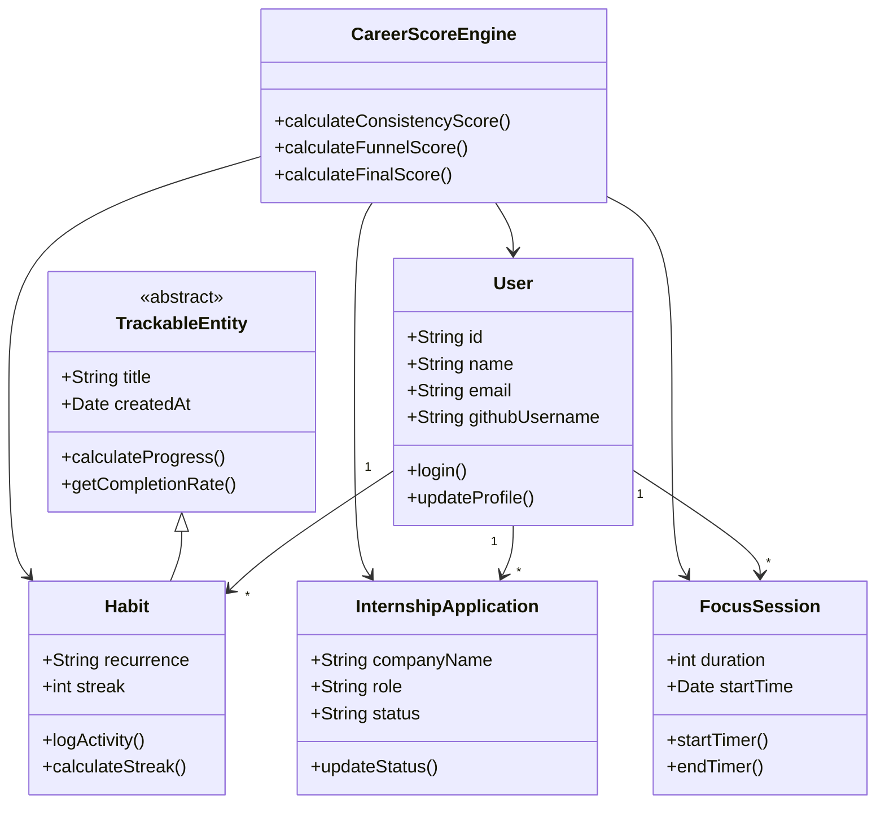

# Class Diagram

```mermaid
classDiagram

class User {
  +String id
  +String name
  +String email
  +String githubUsername
  +login()
  +updateProfile()
}

class TrackableEntity {
  <<abstract>>
  +String title
  +Date createdAt
  +calculateProgress()
  +getCompletionRate()
}

class Habit {
  +String recurrence
  +int streak
  +logActivity()
  +calculateStreak()
}

class InternshipApplication {
  +String companyName
  +String role
  +String status
  +updateStatus()
}

class FocusSession {
  +int duration
  +Date startTime
  +startTimer()
  +endTimer()
}

class CareerScoreEngine {
  +calculateConsistencyScore()
  +calculateFunnelScore()
  +calculateFinalScore()
}

User "1" --> "*" Habit
User "1" --> "*" InternshipApplication
User "1" --> "*" FocusSession

TrackableEntity <|-- Habit

CareerScoreEngine --> User
CareerScoreEngine --> Habit
CareerScoreEngine --> InternshipApplication
CareerScoreEngine --> FocusSession

```