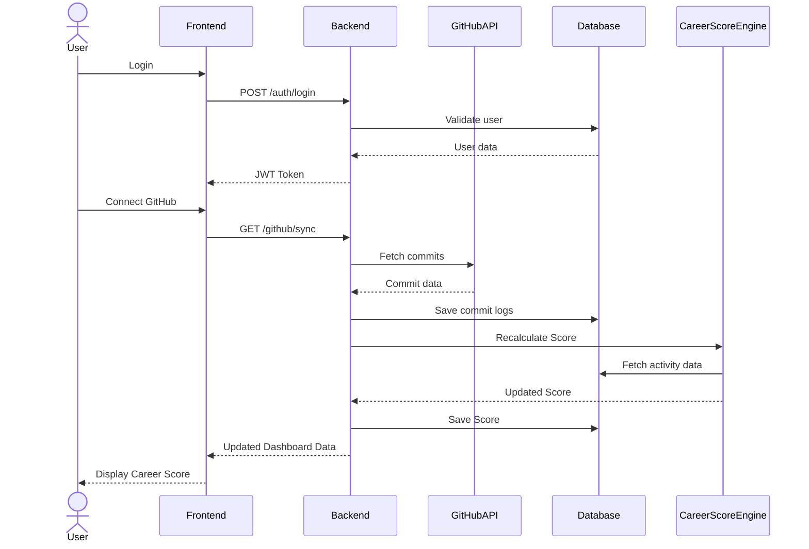

# Sequence Diagram

```mermaid
sequenceDiagram
    actor User
    participant Frontend
    participant Backend
    participant GitHubAPI
    participant Database
    participant CareerScoreEngine

    User->>Frontend: Login
    Frontend->>Backend: POST /auth/login
    Backend->>Database: Validate user
    Database-->>Backend: User data
    Backend-->>Frontend: JWT Token

    User->>Frontend: Connect GitHub
    Frontend->>Backend: GET /github/sync
    Backend->>GitHubAPI: Fetch commits
    GitHubAPI-->>Backend: Commit data
    Backend->>Database: Save commit logs

    Backend->>CareerScoreEngine: Recalculate Score
    CareerScoreEngine->>Database: Fetch activity data
    CareerScoreEngine-->>Backend: Updated Score
    Backend->>Database: Save Score

    Backend-->>Frontend: Updated Dashboard Data
    Frontend-->>User: Display Career Score
```
